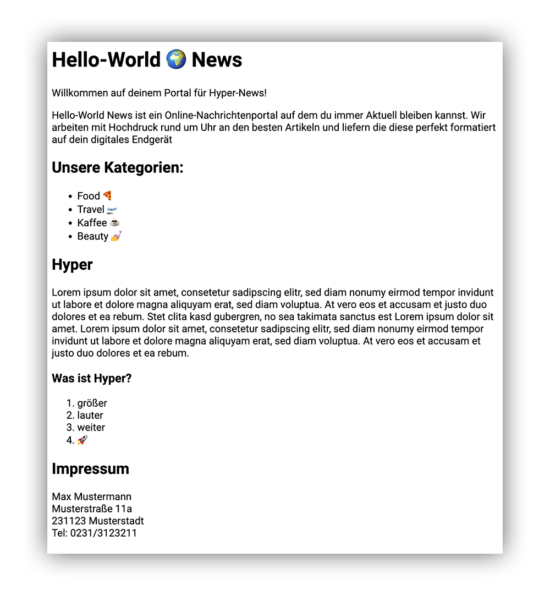

# Hello World

## HTML

### Introduction

Hypertext Markup Language ist keine Programmiersprache, lediglich eine Auszeichnungssprache. Hyper ist Programm und heißt hier _"besser als normaler Text"_. Mit durch sogenannten _Tags_ versehene Inhalte können so von Browsern und beispielsweise Suchmaschinen verarbeitet werden. Anker und Referenzen ermöglichen das Verknüpfen von Inhalten und eine _verschachtelungs_ Hirachie erlaubt das semantische Strukturieren. Hierduch wird allein durch Struktur bereits ein mindestlevel an Interaktivität erreicht.

### Format

Um eine gültige HTML-Datei die von Browsern gelesen werden kann zu erzeugen braucht es nicht viel. Eine Textdatei mit den Endungen `.html` oder `.htm` mit minimalem Boilerplate genügt.

```html
<html>
    <body>
        hello world
    </body>
</html>
```

### Struktur

Die Kernaufgabe von HTML ist es Textinhalte zu strukturieren. Dies geschieht mit den `Tag`'s. Sie markieren die möglichen Abschnitte innerhalb einer Seite/Dokuments. Im oben abgebildeten Boilerplate einer HTML-Datei findest du bereits zwei unterschiedliche Tags. Das `<html>`-Tag sowie das `<body>`-Tag. Der Anfang eines Abschnittes wird mit einem öffnungs Tag markiert `<body>` und das Ende mit dem entsprechenden endungs Tag `</body>`.
Der so marktierte Abschnitt nennt man (drumroll) den Body. Der Browser wird den gasamten darzustellenden Inhalt einer Webseite immer zwischen diesen beiden Tags suchen.
Nun gibt es neben diesem eher Abstrakten Body auch noch etliche weitere HTML-Tags um Abschnitte zu spezifizieren die uns in der Darstellung das lesen erleichtern. Beispielsweise: Überschriften, Absätze, Tabellen, Listen...

#### Übersicht

Im folgenden eine kleine Übersicht der wichtigsten HTML-Tags. Eine komplette Liste aller HMTL-Tags findest du [hier](https://www.w3schools.com/TAgs/default.asp). Die Funktion einiger HTML-Tags werden wir auf Englisch erläutern um dichter am orginal Namen zu bleiben.

|  Tag                  | Funktion                              |
|-----------------------|---------------------------------------|
| `<html>`              | Begin und Ende einer HTML-Datei       |
| `<head>`              | Meta-Daten über die Seite             |
| `<body>`              | Darzustellender Inhalt                |
| `<h1>`,`<h2>`...      | Überschrift hirachisch `h1`-`h6`      |
| `<p>`                 | Paragraph/Absatz                      |
| `<ol>`                | Ordered-List                          |
| `<ul>`                | Unordered-List                        |
| `<li>`                | List-Item                             |
| `<a>`                 | Anchor/Reference/Link                 |
| `<header>`            | Webseiten-Kopfzeile mit Logo etc.     |
| `<footer>`            | Webseiten-Fußzeile mit Legal-Info etc.|
| ``               | Bilder (Images)                       |

### Aufgabe



Erstelle eine HTML-Datei mit dem nötigen Boilerplate. Erweitere diese mit mindestens den folgenden Elementen:

- [ ] 5 Überschriften
- [ ] 3 Absätzen
- [ ] 2 Listen
  - [ ] jeweils 4 Listenelemente
