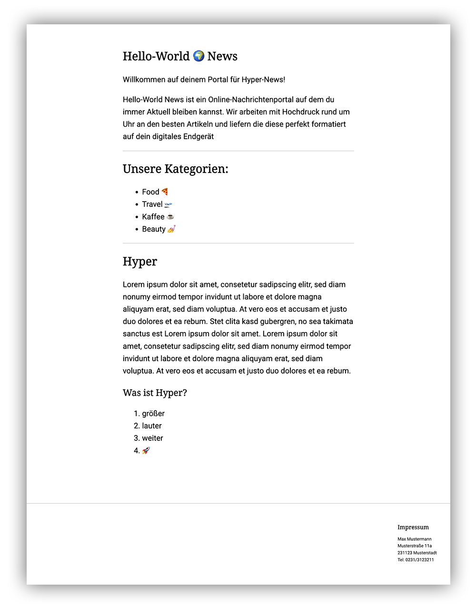

# Basics

## Doctype & Head

```html
<!DOCTYPE html>
<html>
  <head>
    <meta charset="utf-8" />
    <meta name="viewport" content="width=device-width, initial-scale=1.0" />
    <title>Hello-World News</title>
  </head>
  <body>
    hello world
  </body>
</html>
```

Hier siehst du eine erweiterte Version des Boilerplate-Codes der vorherigen Challenge. Neben neuen Abschnitts Tags wie `head`, `meta` und `title` kannst du hier das [`doctype`](https://www.w3schools.com/TAgs/tag_doctype.asp) Tag finden. Mit diesem besonderen Tag ohne schließendem Element kannst du dem Browser mitteilen welchen Dokumenten-Typ du verwendest. Für ältere Versionen von HTML (bspw. HTML 4.01: `<!DOCTYPE HTML PUBLIC "-//W3C//DTD HTML 4.01 Transitional//EN" "http://www.w3.org/TR/html4/loose.dtd">`) war die Deklaration etwas komplexer, doch seit HTML 5 musst du dir nur merken jede HTML-Datei mit `<!DOCTYPE html>` zu beginnen.

Im Abschnitt des ([`head`](https://www.w3schools.com/TAgs/tag_head.asp)), welcher immer zwischen `html`und `body` stehen muss, kannst du die Metadaten der Website definieren. Hier im Beispiel sind die aus unserer Sicht minmalen Angaben bereits ergänzt.
Mit dem meta Tag charset utf-8 setzen wir die Character Dekodierung auf den verbreitesten Standard.
Das meta Tag `name=viewport` gibt uns die Möglichkeit die Dokumenten-Breite mit den Geräte-Breite gleichzusetzten. Dies ist ein Abweichen vom Browser-Standardverhalten welches mobile Endgeräte noch nicht bedenkt und bei kleiner Anzeige ein breiteres Dokument mit horizontalem Scrollen bereitstellt.

### Challenge 1

Ergänze den [] Doctype sowie den [] Head in deiner `Hello-World` Webseite aus der vorherigen Challenge. (Falls du erst mit dieser Challenge einsteigst haben wir dir [hier](index.html) eine Lösung für dich vorbereitet)

## Style/CSS

### CSS Basics

Um Anpassungen an der Standartdarstellung vorzunehmen kannst du HTML-Tags mit CSS-Styles/Rules versehen. [CSS steht für Cascading-Style-Sheet](https://developer.mozilla.org/en-US/docs/Glossary/CSS) - Hierzu kannst du das _Style-Sheet_ auf unterschiedliche Weisen dem Browser zur Verfügung stellen. Die für uns hier unkomplizierteste ist das Öffnen eines Style-Tags im `head`.

```html
<style>
  /* style goes here */
</style>
```

Innerhalb des Style-Tags kannst du nun CSS-Rules definieren. Eine CSS-Rule besteht aus einem Selector und einer Declaration (welche wiederum aus einer Property und einer zugewiesenen Value besteht). Der Selector kann ein Tag-Typ selbst sein, wie z.B. `p`, `h1`, `section`... Allerdings empfehlen wir dir allen Tags die du mit Styles versehen willst einen Klassennamen Attribut `class=""` zu verleihen.

```html
<div class="content">...</div>
```

Denn Attribute können ebenfalls als Selector genutzt werden und entkoppeln deine Styles vom Tag-Typ der sich unter Umständen später noch einmal ändern kann. Klassennamen werden mit einem vorangehenden `.` versehen, ID's mit einer `#` und belibige andere Attribute wie z.B. `data-attr="test"` sind ebenfalls möglich `[data-attr="test"]`. Dem Selector folgen innerhalb `{}` dann die Declarations (min. eine). [Style Properties](https://developer.mozilla.org/en-US/docs/Web/CSS/Reference#index) einer Declaration gibt es zahlreiche. Wie ihre spezifische `Value` angegeben wird solltest du zu Begin nachschlagen. Die `width` beispielsweise kann in `px`, `em`, `rem`, `vh` und `%` angegeben werden, akzeptiert jedoch auch spezifische angaben wie `max-content` usw. hier gilt es ein Rabbithole an Möglichkeiten zu erkunden.

```css
.content {
  max-width: 480px;
}
```

#### Challenge 2

Informiere dich über mögliche Declarations und Style das [hier](index.html) vorbereitete Markup. ⚠️ Versuche ohne das Markup zu verändern die Styles aus dem folgenden Bild zu erreichen.



### Cascading

In CSS bezieht sich der Begriff "Cascading" auf die Art und Weise, wie Styles auf HTML-Elemente angewendet werden. Wenn mehrere Styles für dasselbe Element definiert sind, folgt der Browser einer Reihe von Regeln, um zu bestimmen, welcher Style angewendet werden soll.

Die Reihenfolge des Cascadings ist wie folgt:

1. Inline-Styles: Styles, die direkt auf dem HTML-Element mit dem `style`-Attribut definiert sind.
2. Interne Stylesheets: Styles, die innerhalb der `<style>`-Tags im `<head>`-Bereich des HTML-Dokuments definiert sind.
3. Externe Stylesheets: Styles, die in separaten CSS-Dateien definiert sind und mit dem HTML-Dokument über das `<link>`-Tag verknüpft sind.

Wenn sich konkurrierende Styles auf verschiedenen Ebenen befinden, wird der Style mit der höchsten Spezifität angewendet. Die Spezifität wird durch die Kombination der Selektoren bestimmt, die auf das Element abzielen.

Es ist wichtig, die kaskadierende Natur von CSS zu verstehen, um Webseiten effektiv zu gestalten und die Hierarchie der Styles zu verwalten.

### Spezifität

In CSS bezieht sich der Begriff "Spezifität" auf die Art und Weise, wie Styles auf HTML-Elemente angewendet werden. Wenn mehrere Styles für dasselbe Element definiert sind, folgt der Browser einer Reihe von Regeln, um zu bestimmen, welcher Style angewendet werden soll.

Die Spezifität wird durch die Kombination der Selektoren bestimmt, die auf das Element abzielen. Dabei werden verschiedene Faktoren berücksichtigt, wie z.B. die Anzahl der IDs, Klassen und Elementnamen in einem Selektor.

Im Allgemeinen gilt: Je spezifischer ein Selektor ist, desto höher ist seine Spezifität und desto wahrscheinlicher wird er angewendet.

Es ist wichtig, die Spezifität zu verstehen, um Konflikte zwischen Styles zu vermeiden und die gewünschten Styles auf die richtigen Elemente anzuwenden.

Hier sind einige Beispiele zur Veranschaulichung der Spezifität:

- `h1` hat eine niedrigere Spezifität als `.title`, da der Klassenselektor spezifischer ist.
- `.content p` hat eine höhere Spezifität als `.content`, da der Selektor zwei Elementnamen enthält.
- `#header .logo` hat eine höhere Spezifität als `.logo`, da der Selektor eine ID und eine Klasse enthält.

Es ist wichtig, die Spezifität der Selektoren zu berücksichtigen, um sicherzustellen, dass die gewünschten Styles angewendet werden.

### Pseudo-Classes

Pseudo-Klassen sind spezielle CSS-Selektoren, die verwendet werden, um bestimmte Zustände oder Eigenschaften von HTML-Elementen auszuwählen und zu stylen. Sie ermöglichen es uns, Elemente basierend auf Ereignissen oder Zuständen auszuwählen, die nicht direkt im HTML-Code angegeben sind.

Ein Beispiel für eine Pseudo-Klasse ist :hover. Diese Pseudo-Klasse wird angewendet, wenn der Mauszeiger über ein Element schwebt. Wir können es verwenden, um das Styling des Elements zu ändern, wenn der Benutzer mit der Maus darüber fährt. Zum Beispiel können wir den Hintergrund eines Links ändern, wenn der Benutzer mit der Maus darüber fährt:

Eine andere nützliche Pseudo-Klasse ist :nth-child(). Diese Pseudo-Klasse ermöglicht es uns, bestimmte Elemente basierend auf ihrer Position in der Elternliste auszuwählen. Zum Beispiel können wir jedes zweite Element in einer Liste hervorheben:

Es gibt viele weitere Pseudo-Klassen wie :active, :focus, :first-child, :last-child, usw. Jede Pseudo-Klasse hat ihre eigene Funktion und Verwendung. Sie ermöglichen es uns, CSS-Stile auf spezifische Elemente anzuwenden, basierend auf ihren Zuständen oder Positionen.

```css
.button:hover {
  /*...*/
}

.link:visted {
  /*...*/
}

.item:last-child {
  /*...*/
}
```

### Positioning

Durch Positioning können Elemente auf der Seite platziert oder in ihrem Verhalten verändert werden.
Dabei können sie sich überlagern, relativ zueinander verschoben oder an das Browserfenster gekoppelt werden.
Sieh dir dazu einmal [diesen Artikel](https://developer.mozilla.org/en-US/docs/Learn/CSS/CSS_layout/Positioning) an. Das MDN ist eine gute Quelle zum eigenständigen Lernen und Nachschlagen.

#### Challenge 3

Für diese Challenge musst du das Markup verändern. Füge einen Header mit Logo und Navigation hinzu. Zentriere den Inhalt des Headers und achte auf das Scrollverhalten im Beispiel.


### Media Queries

Mithilfe von Media Queries kann das Styling von Elementen von der verfügbaren Fensterbreite abhängig gemacht werden.
Bspw. sollen Elemente auf einem schmalen Handyscreen untereinander dargestellt werden, auf einem breiten Desktop-Browser aber nebeneinander.
Entscheidend ist dabei die minimale Breite des Fensters, sobald diese erreicht wird, können neue Styles hinzugefügt werden oder die bisherigen überschreiben.

Weitere Infos [hier](https://developer.mozilla.org/en-US/docs/Learn/CSS/CSS_layout/Media_queries).

```css
@media screen and (min-width: 768px) {
  /* desktop styles */
}
```

#### Challenge 4

Verändere dein Stylesheet, Ziel ist es mit der oben erläuterten Media Query alle Desktop spezifischen Declarations zur Ausnahmeregelung für große Bildschirmgrößen zu machen.


