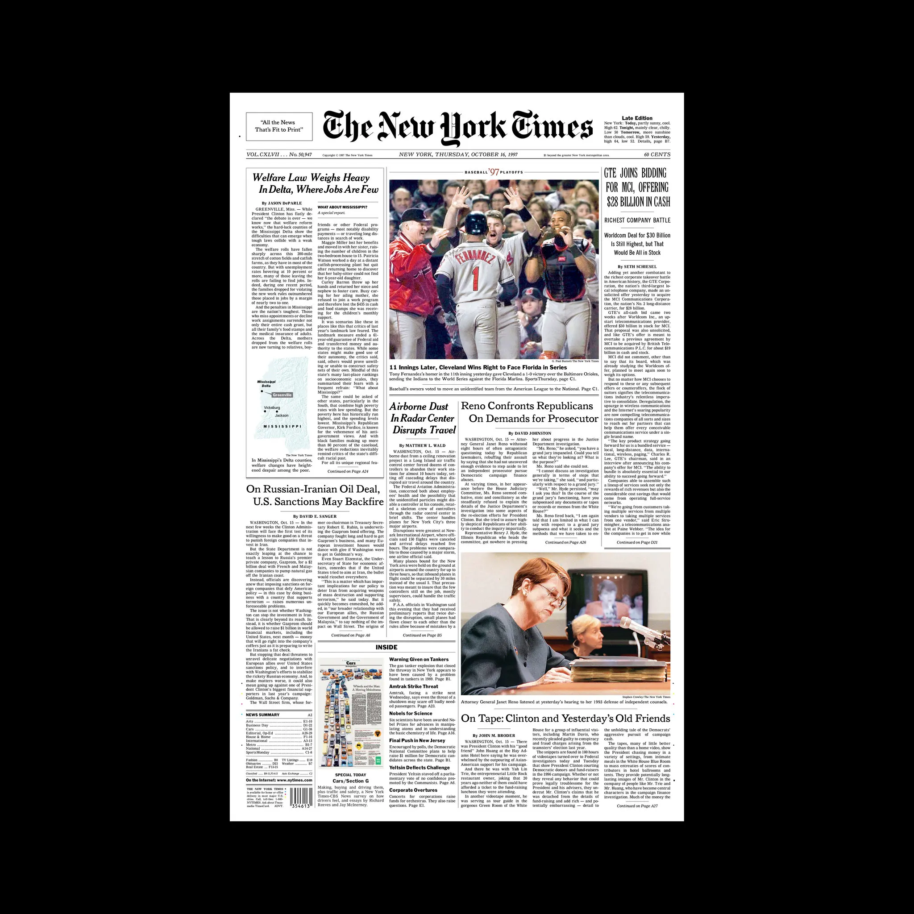

# Newspaper

In der Challenge _Newspaper_ stellt ihr euer Layout-Können mit HTML & CSS auf den Prüfstand. Ihr sollt nur mittels HTML & CSS, sowie von euch möglichst passend ausgewählten [Webfonts](https://fonts.google.com/) die unten dargestellte Seite der New York Times nachbauen. Alle ausserdem benötigten Assets findet ihr [hier](./assets). Überschriften könnt ihr übernehmen und für den Fließtext der Artikel benutzen ihr am besten [Blindtext](https://www.lipsum.com/).

Achtet in dieser Challenge auf die Details! Es geht nicht darum möglichst schnell etwas Ähnliches zu erschaffen sondern neben euren HTML & CSS Kenntnissen auch ein Gespühr für verhältnisgetreue und passend geschätzte Abstände zu entwickeln.

