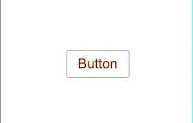
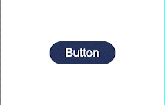
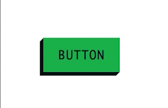
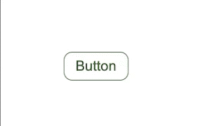

# Css-Animations

In der Challange _css-animations_ vertiefst du dein Wissen im Bereich css und lernst zudem wie du deinen Code etwas besser strukturieren kannst. Setze die Designs der verschiedenen Buttons um und achte hierbei auch auf die hover und active states. Eine `index.html` haben wir für dich bereits angelegt. Dort findest du das Markup für einige Buttons inkl. Klassennamen.

Auch hier steckt der Teufel wieder im Detail: Versuche die Designs so detailliert wie möglich umzusetzen und zwar ohne Anpassungen am Markup vorzunehmen! Hierzu wirst du wahrscheinlich mit `Pseudoklassen`, `Pseudoselektoren` und `Pseudoelementen` arbeiten.

## Organisation des css

Damit das ganze etwas übersichtlicher bleibt, sollst du für die jeweiligen Buttons ein eigenes Stylesheet anlegen. Diese Stylesheets importierst du in `styles.css`. Deine Ordnerstruktur sollte also wie folgt aussehen:

```
.
├── css
│   ├── components
│   │   ├── btn-fade-in.css
│   │   ├── btn-fancy.css
│   │   ├── btn-modern.css
│   │   └── btn-shake.css
│   └── styles.css
└── index.html
```

## Die Buttons

### 01 - Modern

Ein moderner Klassiker: Abgerundete Ecken, Schatten beim Hovern und Transparenz beim Click!



### 02 - Fade-In

Hier ist schon etwas mehr gefragt: Der Text auf dem Button verschiebt sich beim Hover nach links. Zudem erscheint ein Icon, welches beim Click zu einem anderen Icon wird!



### 03 - Fancy

Bei diesem Retro-Button kommt einiges zusammen. Denk dran, das Markup darf nicht verändert werden!



### 04 - Shake

Hier wird es nochmal besonders: Versuche dir mit Keyframe-Animationen das Leben etwas leichter zu machen.



### 05 - Make it yours!

Zeig was du kannst! Entwickle deinen eigenen Button. Dir sind keine Grenzen gesetzt!
