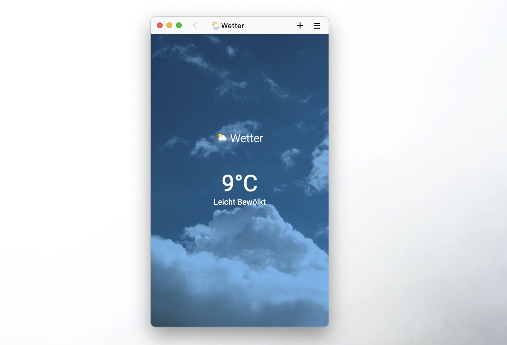

# Weather

## Challenge

In dieser Challenge baust du eine Wetter-App im Browser. Dazu fragst du Wetter-Daten von der offenen API [Open-Meteao](https://open-meteo.com/en/docs) an deiner aktuelle Position/Geolocation ab um sie im Browser anzuzeigen. Versuche mindestens die aktuelle Temperatur und eine Beschreibung der aktuellen Wetterlage anzuzeigen. Gehe ausserdem in der Darstellung der Seite auf das aktuelle Wetter ein. Wie genau du dies anstellst bleibt dir überlassen.

Benutze keine Packages, Libaries oder Frameworks. Nur HTML, CSS & JavaScript (Vanilla) sind erlaubt.

Beispiel API-URL:

```text
https://api.open-meteo.com/v1/forecast?latitude=53.073635&longitude=8.806422&daily=weathercode,temperature_2m_max,temperature_2m_min,apparent_temperature_max,apparent_temperature_min,sunrise,sunset,precipitation_sum,rain_sum,showers_sum,snowfall_sum,precipitation_hours,windspeed_10m_max,windgusts_10m_max,winddirection_10m_dominant&timezone=Europe%2FBerlin
```



## Zusatz

Die API liefert noch zahlreiche weitere Werte wie z.B. Windrichtung. Wenn du den ersten Teil der Challenge problemlos lösen konntest, überlege dir weitere Features und visualisiere diese. (Windrichtung, Wochenaussicht, Städteauswahl)
