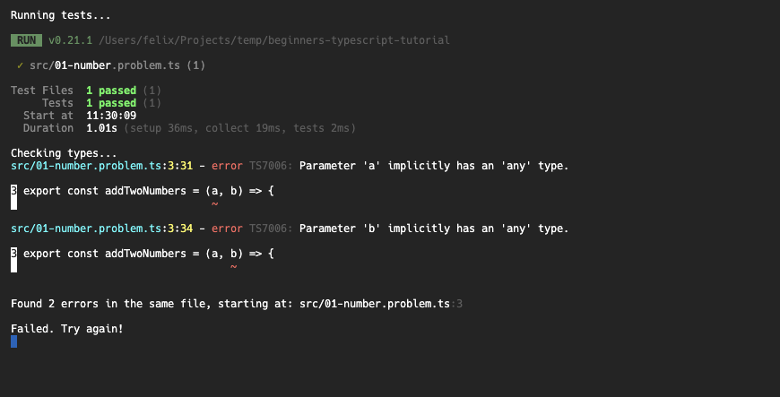

# Typescript

JavaScript ist vielseitig einsetzbar, leicht zu lernen und hat eine riesige Comunity. Doch was JavaScript fehlt ist Typensicherheit. Um eine größere Codebase zu pflegen sollte man nicht darauf verzichten Typen zu deklarieren um Bugs vorzubeugen und leicht verständlichen Code zu schreiben. Ausserdem hilft dir Typescript dabei Fremdsoftware wie z.B. Libaries und Frameworks direkt innerhalb deines Codes zu verstehen und spart so viel Zeit die du sonst in Dokumentationen verbracht hättest. Um besser zu verstehen wie JavaScript & TypeScript zusammengehören und was "Typensicherheit" überhaupt ist lese [diesen Artikel](https://www.typescriptlang.org/docs/handbook/typescript-from-scratch.html) aus den TypeScript Docs.

## Challenge

Die Folgende Challenge ist nicht unsere eigene, sondern besteht aus 18 kleinen Aufgaben die den [_"Beginner's-TypeScript"_](https://www.totaltypescript.com/tutorials/beginners-typescript) Kurs von Matt Pocock bilden. Klone dir dazu das zugehörige [Repository](https://github.com/total-typescript/beginners-typescript-tutorial)installiere die Abhängigkeiten und arbeite die Aufgaben innerhalb des `src`-Verzeichnisses chronologisch durch.

```bash
# Installs all dependencies
npm install

# Starts the first exercise
npm run exercise 01

# Runs linting and tests on the solution
npm run solution 01
````


