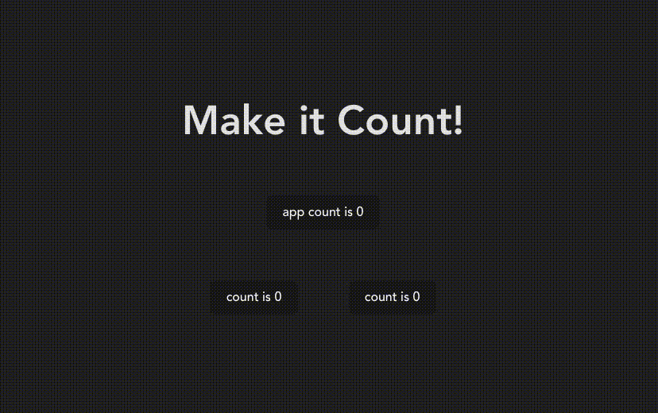

# Challenge

Ziel ist es eine kleine Anwendung zu erstellen, mit welcher sich Zählerstände verändern lassen. Die React App kannst du aufsetzen wie du magst.

Informiere dich gerne über die verschiedenen Weisen, auf die sich eine React App aufsetzen lässt - Als Frontend Enwtickler\*in sind auch solche Recherchen Teil deines Alltags:

- [create-react-app](https://create-react-app.dev/)
- [next](https://nextjs.org/)
- [vite](https://vitejs.dev/)
- [nx](https://nx.dev/)
- ...

Wir empfehlen dir mit dem [typescript react-template von vite](https://vitejs.dev/guide/#scaffolding-your-first-vite-project) zu beginnen. Vite gibt dir bereits ausgereiftes und modernes Tooling an die Hand, sodass du dir erstmal nicht zu viele Sorgen um das Setup deiner React-App machen musst.

Du wirst dir jedoch noch überlegen müssen, wie du deine Styles organisieren möchtest. Auch hier stehst du wieder vor der Qual der Wahl:

- Reguläre Css Imports (In den meisten modernen Tools wie bspw [vite](https://vitejs.dev/guide/features.html#css) kannst du css Dateien einfach in deine React-Component importieren)
- [styled-components](https://styled-components.com/)
- [jss](https://cssinjs.org/?v=v10.9.2)
- [tailwind](https://tailwindcss.com/)
- ...

## Resources

Falls du noch keine Erfahrung mit React hast findest du hier einen [Quickstart-Guide](https://beta.reactjs.org/learn), welcher dich in die Prinzipien von React einführt.

## Challenge

Entwickle eine Anwendung mit welcher du Zählerstände hochzählen kannst. Das Ganze hat jedoch einen kleinen Kniff:

Die App hat 3 Buttons. Zwei der Buttons erhöhen ihren Zählerstand um 1, wenn sie geklickt werden. Einer der Buttons zeigt seinen Zählerstand an, erhöht aber den Zählerstand aller buttons um 1, wenn er geklickt wird. Zudem wird alle 2 Sekunden der Zählerstand aller Buttons um 1 erhöht.
